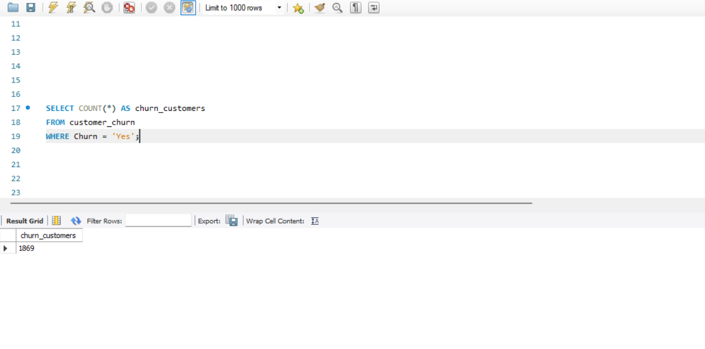

# Customer Churn Analysis

## 📊 Project Overview

This is an end-to-end Data Analytics project that analyzes customer churn using Python, MySQL, and Power BI.

## 🛠️ Tools Used

- Python (Pandas)
- MySQL
- Power BI

## 📌 Project Workflow

1. Data Cleaning using Python
2. SQL Analysis using MySQL
3. Dashboard Development using Power BI

## 📈 Dashboard KPIs

- Total Customers
- Active Customers
- Churn Customers
- Churn Rate
- Monthly Charges
- Revenue

## 📊 Dashboard Preview

